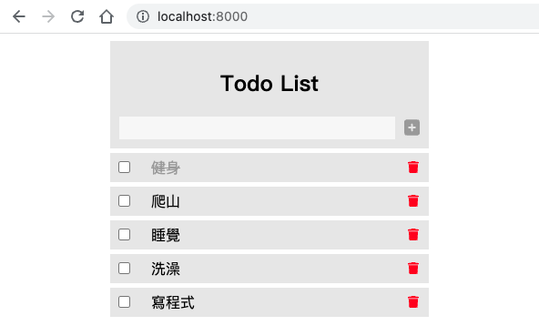

# Laravel 8 + vue3
- Laravel: 8.75
- Vue: 3.2版




## 前端
```
npm install
npm run hot
npm run dev
```

前端 vue 檔，請求 API 方式來渲染畫面
- app.vue
- AddItemForm
- ListItem
- ListView

## 後端
複製 .env 建立資料庫，做三隻簡單 CRUD API ，讓前端打資料
```
composer update
php artisan migrate
php artisan serve
```
